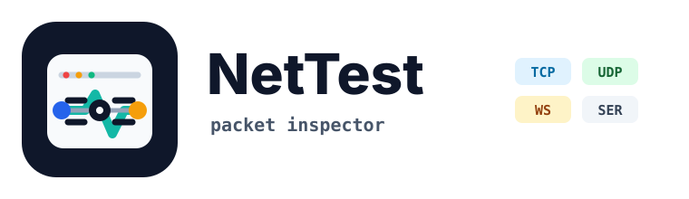

# NetTest

<p>
  
</p>

NetTest is a desktop packet inspector for TCP, UDP, WebSocket, Serial, and mock streams. It captures live traffic, shows RX/TX packets in a hex viewer, decodes binary payloads with configurable field schemas, and can send manual or generated bytes back through active connections.

## Features

- TCP, UDP, WebSocket, Serial, and mock transports.
- Client/server connection presets with persisted local state.
- Live packet capture with RX/TX direction, pause, follow, clear, and packet selection.
- Hex viewer with parser-aware field highlighting.
- Configurable struct parser for integers, floats, strings, enums, bitfields, padding, and endian settings.
- Per-connection parser schemas plus reusable struct presets.
- Send panel for manually entered or generated payload bytes.
- Small UI tweak panel for display preferences.

## Tech Stack

- Electron and electron-vite
- React 18 and Vite
- Tailwind CSS
- Node.js networking APIs, `ws`, and `serialport`

## Requirements

- Node.js 18 or newer
- npm
- A desktop environment capable of running Electron

Serial transport support may require the native build prerequisites used by `serialport` on your platform.

## Setup

Install dependencies:

```sh
npm install
```

Run the app in development:

```sh
npm run dev
```

Build production assets:

```sh
npm run build:vite
```

Create a packaged app with electron-builder:

```sh
npm run build
```

Create an unpacked app directory for local inspection:

```sh
npm run pack
```

Preview the built app:

```sh
npm run preview
```

## Smoke Test

The standalone smoke test exercises mock, TCP, UDP, and WebSocket transports without launching Electron:

```sh
node scripts/smoke-test.js
```

## Project Structure

```text
src/main/                Electron main process and IPC registration
src/main/transports/     TCP, UDP, WebSocket, Serial, and mock transports
src/preload/             Safe renderer bridge exposed as window.nettest
src/renderer/            React renderer application
src/renderer/src/lib/    Parser, persistence, connection, and utility logic
src/renderer/src/components/
scripts/                 Development and validation scripts
resources/               Static app resources
```

Generated compile output is written to `out/` by electron-vite. Packaged apps and installers are written to `dist/` by electron-builder. Both directories are ignored by git.

## Usage Notes

1. Start the app with `npm run dev`.
2. Select or create a connection in the connection panel.
3. Configure the protocol, role, bind address, or remote endpoint.
4. Start the connection to capture incoming packets.
5. Define a parser schema or load a preset to decode the active packet.
6. Use the send panel to transmit manual or generated byte payloads.

Connection definitions are saved in Electron's user data directory. Parser schemas and UI preferences are saved locally by the renderer.

## License

MIT
